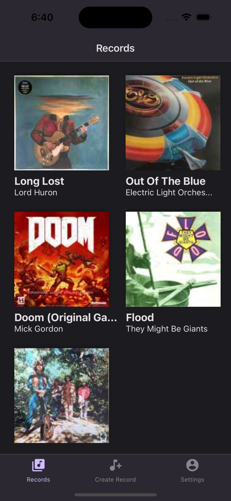
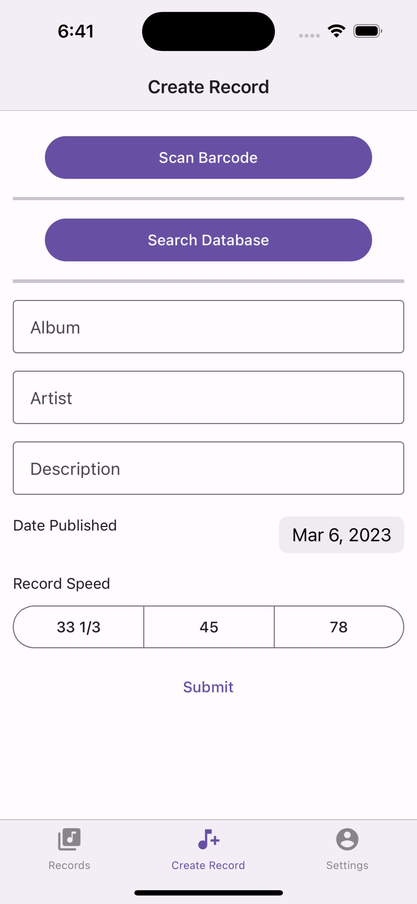
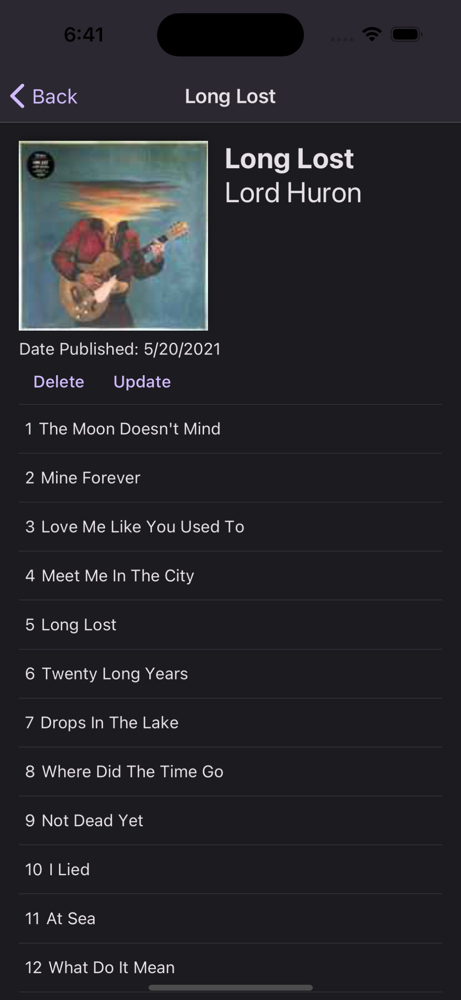

# Vinyl Vault

<a href="https://reactnative.dev/" target="_new"></a>

<a href="https://opensource.org/licenses/MIT" target="_new"></a>

An app for tracking your vinyl record collection.

## Features

- Scan barcode to add info automatically
- Light/dark mode toggle
- Cross platform (iOS and Android)

## Installation

Rename `.env.example` to `.env` and replace the values with your api keys.

Install Vinyl Vault with npm

```bash
  git clone https://github.com/Alitma5094/Vinyl-Vault.git
  cd vinyl-vault
  npm install
  npm start
```

## Screenshots





## License

[MIT](https://choosealicense.com/licenses/mit/)
